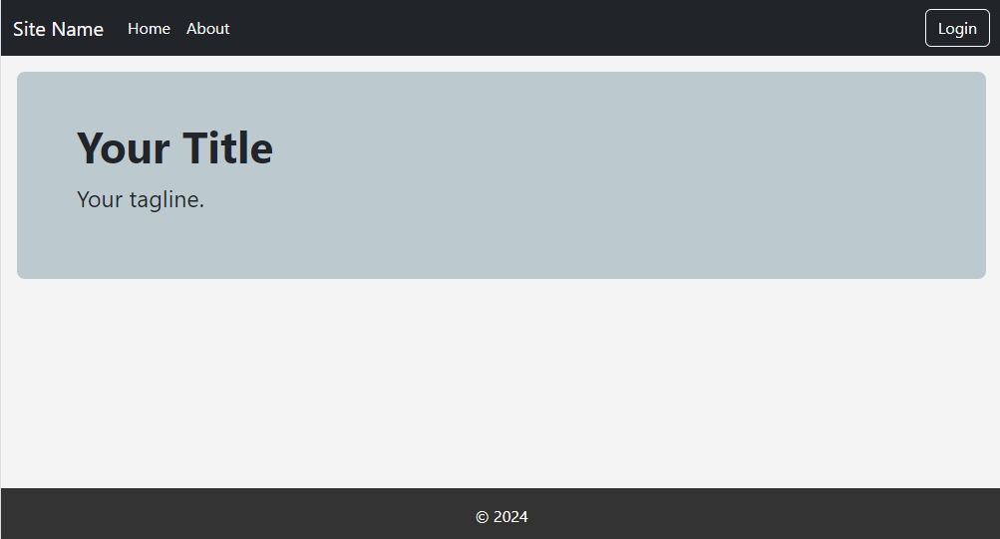
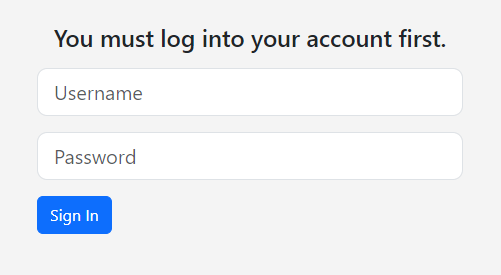
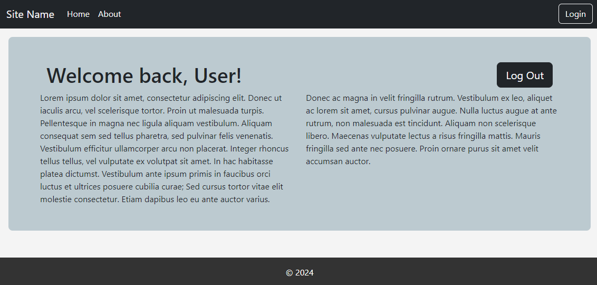

A simple membership website. 
### Backend
- Python handles rest API requests including login and other backend operations.

### Frontend
- Built in ReactJS, calls rest API endpoint and displays results.

### Docker
- Creates Docker containers.

--

## Setup

### Start Docker
- Run Docker desktop
- Go to directory and run the command
    `docker-compose up --build`
- If stop is needed
    `docker-compose down`

### Troubleshooting

- If using Windows, `/backend/entrypoint.sh` should be in LF format.
